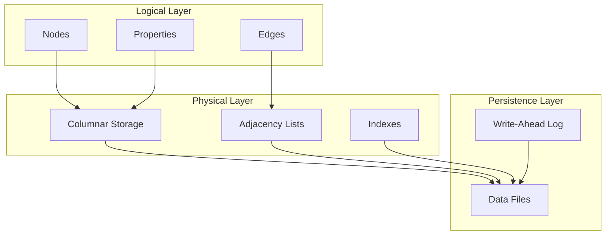

# Storage Model

Grafeo uses a hybrid storage model optimized for graph workloads.

## Overview

## Sections

-   **[Columnar Properties](columnar.md)**

    ---

    Type-specific columnar storage for properties.

-   **[Adjacency Lists](adjacency.md)**

    ---

    Chunked adjacency lists for edge traversal.

-   **[Zone Maps](zone-maps.md)**

    ---

    Statistics for data skipping.

-   **[Compression](compression.md)**

    ---

    Type-specific compression strategies.

-   **[Container Format](container-format.md)**

    ---

    `.grafeo` file format: section-based container with crash safety.

-   **[CompactStore v5 mapped layout](compact-store-v5-mapped-layout.md)**

    ---

    G-EM0 decision and source contract for disk-native compact reopen.

-   **[Ring Index](ring-index.md)**

    ---

    Wavelet-tree based compact triple index for RDF data (~3x space reduction).

